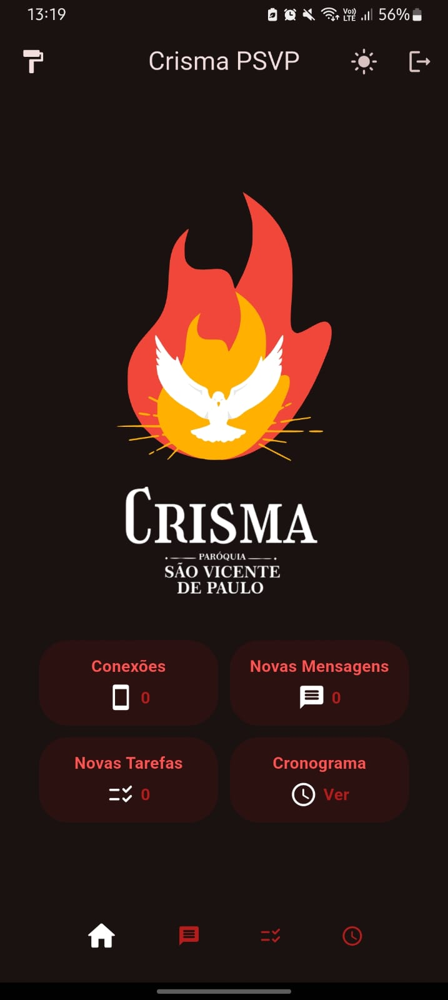
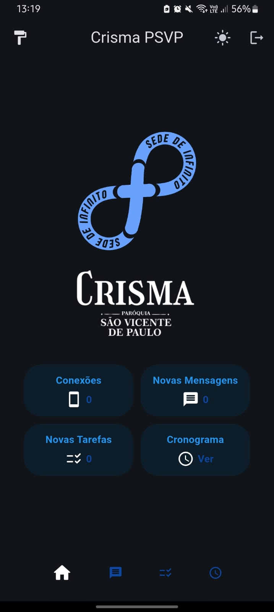
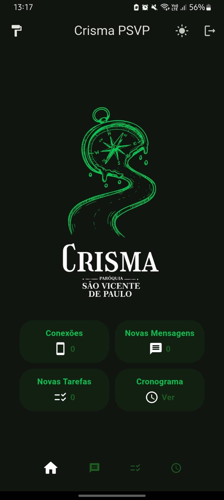
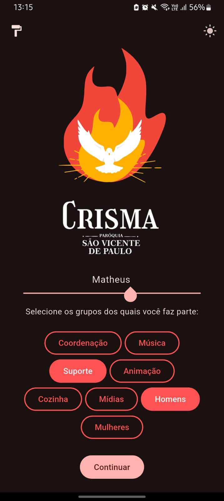
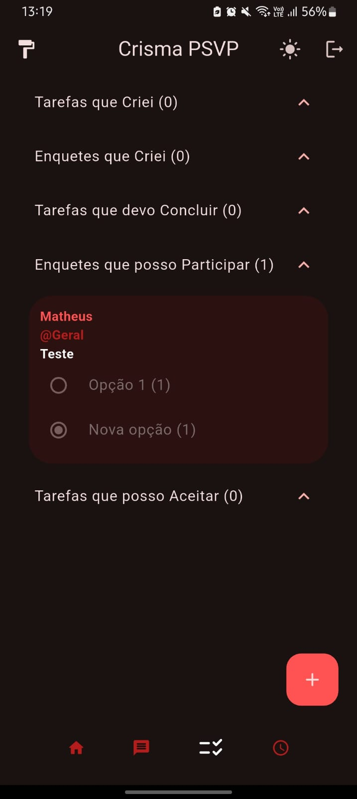

# Crisma PSVP

Instagram: [@crismapsvp](https://instagram.com/crismapsvp)

Durante o retiro de Crisma da Paróquia São Vicente de Paulo de Belo Horizonte, a comunicação entre líderes e participantes dependia de rádios comunicadores — equipamentos limitados em quantidade, que exigiam que as pessoas permanecessem próximas a um dos rádios para ouvir as mensagens, e que permitiam a comunicação direta de apenas alguns membros da equipe.

O app **Crisma PSVP** busca resolver essa limitação: um app para múltiplos dispositivos que utiliza uma rede local Wi-Fi para oferecer comunicação fluida e em tempo real, permitindo a troca de mensagens, tarefas, enquetes e PDFs sem depender de conexão com a internet, estando disponível a todos os membros da equipe, em seus próprios smartphones ou computadores.

## Imagens

<table>
    <tr>
        <td></td>
        <td></td>
        <td></td>
    </tr>
    <tr>
        <td></td>
        <td></td>
        <td></td>
    </tr>
</table>

## Funcionalidades

- **Comunicação via rede local**  
  - Permite envio de mensagens e comunicação em rede local, sem necessidade de internet.  
  - Descoberta de outros usuários na rede via broadcast utilizando o protocolo UDP.  
  - Conexão via TCP para envio confiável de mensagens, tarefas, enquetes e PDFs.  
  - Reconexão automática e remoção de peers inativos.  
  - Indicador em tempo real do número de usuários (peers) conectados.

- **Login e autenticação de grupos**  
  - Cada usuário pode se autenticar com seu nome.  
  - Para acessar um grupo, o usuário deve digitar uma senha exclusiva daquele grupo, garantindo a segurança e a exclusividade do acesso.  
  - Botão de logout para trocar de usuário/grupo sem reiniciar o app.

- **Mensagens organizadas por grupo e tags**  
  - As mensagens são separadas por tags, permitindo organização clara e eficiente da comunicação.  
  - Confirmação de leitura: cada mensagem mostra quem já a visualizou.  
  - Opção de deletar para todos usuários mensagens enviadas manualmente.  
  - Notificações locais para novas mensagens.

- **Gerenciamento de tarefas**  
  - Os usuários podem criar, aceitar e concluir tarefas.  
  - As tarefas são também organizadas por tags.  
  - Expiração automática: tarefas com mais de 24h são removidas ao iniciar o app.  
  - Dashboard na Home exibe contador de tarefas pendentes.  
  - Notificações locais para novas tarefas.

- **Gerenciamento de enquetes**  
  - Os usuários podem criar e votar em enquetes.  
  - Suporte a respostas customizadas e voto único por dispositivo.  
  - Organização por tags e dashboard com contador de enquetes ativas.
  - Expiração automática: enquetes com mais de 24h são removidas ao iniciar o app.  
  - Notificações locais para novas enquetes.

- **Cronograma em PDF**  
  - Visualização do cronograma atualizado em formato PDF.  
  - Possibilidade de atualizar o cronograma diretamente pelo aplicativo (upload em rede local).  
  - Notificação local quando um novo cronograma é recebido.
 
- **Envio de novos PDFs (Grupo da Música)**  
  - Página exclusiva para o grupo de música adicionar novos PDFs de cifras.  
  - Sincronização automática de cifras entre os peers.  

- **Temas de cor**  
  - Disponibilidade de 3 temas de cor, cada um com versões claras e escuras.  
  - Botão para alternar tema e troca em tempo real.  
  - Lotties customizadas para cada tema.


## Tecnologias Utilizadas

- **Flutter**: Framework para desenvolvimento do app.  
- **Dart**: Linguagem de programação utilizada no desenvolvimento.  
- **Hive_CE e Hive_CE_Flutter**: Bancos de dados locais para armazenamento eficiente.  
- **flutter_pdfview**: Para visualização de arquivos PDF.  
- **file_picker**: Para seleção e upload de novos PDFs.  
- **flutter_local_notifications**: Para notificações locais.  
- **Lottie**: Para renderização de animações.  
- **Path Provider**: Para gerenciamento de caminhos de arquivos.  
- **collection**: Helpers para comparação profunda de listas e hashing.

## Como Rodar o Projeto

- Instale o APK adequado ao seu dispositivo, disponível na pasta [`/apks`](./apks).
  
- Ou, se preferir:
1. Clone este repositório:
   ```sh
   git clone https://github.com/MatheusGHenriques/Crisma-PSVP.git
   cd Crisma-PSVP
   ```
2. Instale as dependências:
   ```sh
   flutter pub get
   ```
3. Execute o aplicativo:
   ```sh
   flutter run
   ```

## Licença

Este software é protegido por direitos autorais. Para mais detalhes, consulte o arquivo [LICENSE](./LICENSE).

Somente a Paróquia São Vicente de Paulo de Belo Horizonte e suas pastorais podem utilizar o app sem necessidade de autorização escrita.

Testes para avaliar o funcionamento do app também podem ser feitos sem autorização.

Qualquer outro uso exige autorização prévia do autor.

Contate matheusghenriques@proton.me para permissões.
