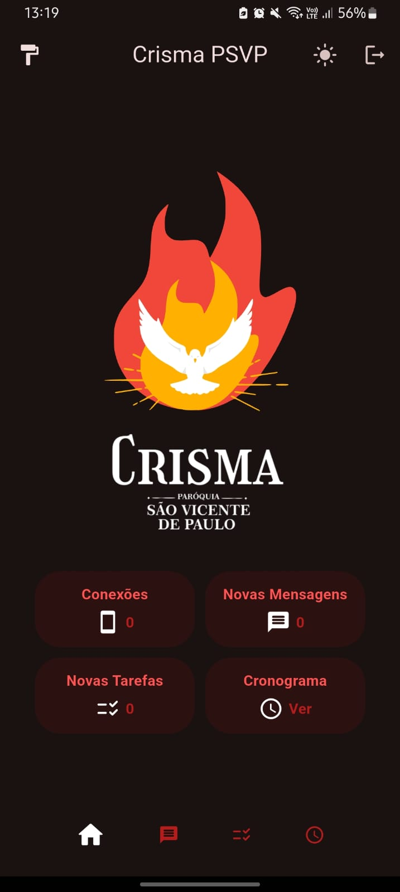
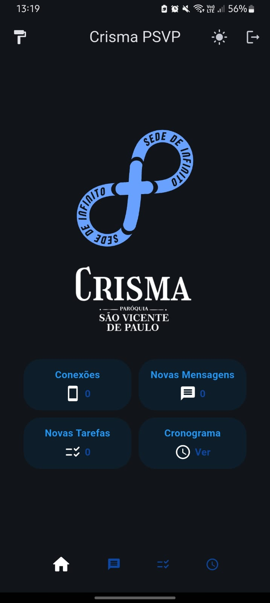
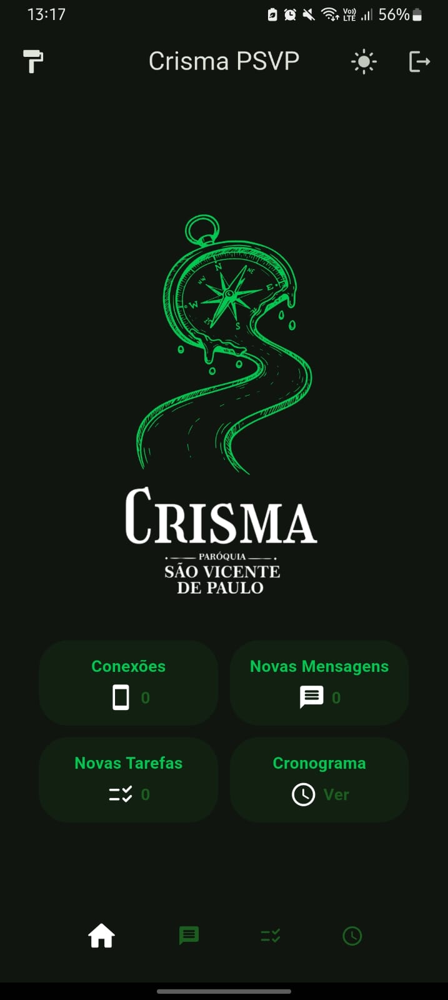
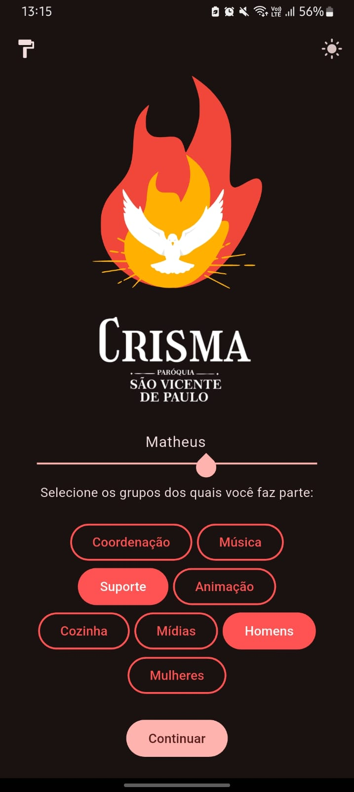
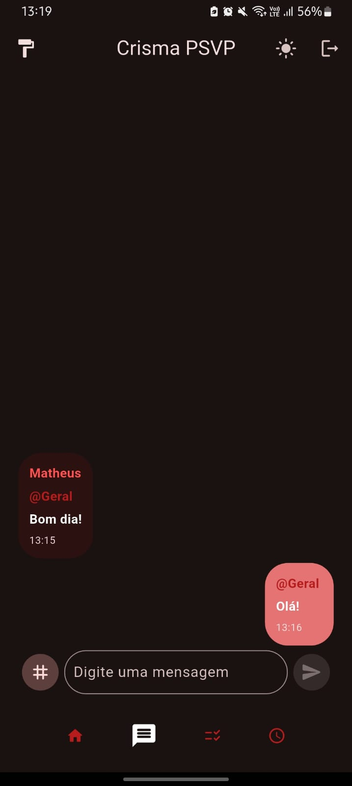
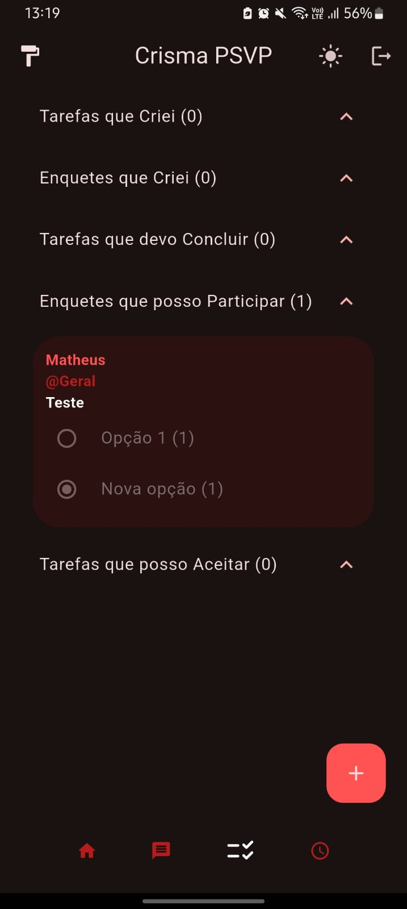

# Crisma PSVP

Instagram: [@crismapsvp](https://instagram.com/crismapsvp)

Durante o retiro de Crisma da Paróquia São Vicente de Paulo de Belo Horizonte, a comunicação entre líderes e participantes dependia de rádios comunicadores - equipamentos limitados em quantidade, que exigiam que as pessoas permanecessem próximas a um dos rádios para ouvir as mensagens, e que permitiam a comunicação direta de apenas alguns membros da equipe.

O app **Crisma PSVP** busca resolver essa limitação: um app para múltiplos dispositivos que utiliza uma rede local Wi-Fi para oferecer comunicação fluida, segura e em tempo real, permitindo a troca de mensagens, tarefas, enquetes e PDFs sem depender de conexão com a internet, estando disponível a todos os membros da equipe, em seus próprios smartphones ou computadores.

## Imagens

<table>
    <tr>
        <td></td>
        <td></td>
        <td></td>
    </tr>
    <tr>
        <td></td>
        <td></td>
        <td></td>
    </tr>
</table>

## Funcionalidades

- **Comunicação totalmente offline por rede local (LAN/Wi-Fi)**
  - Envio de mensagens, tarefas, enquetes e PDFs sem depender de internet.
  - Descoberta automática de usuários via broadcast UDP.
  - Conexões seguras via TCP para troca confiável de dados.
  - Reconexão automática e remoção de usuários inativos.
  - Exibição em tempo real do número de usuários conectados.

- **Acesso seguro por grupos com autenticação**
  - Login com nome personalizado e senha exclusiva para cada grupo.
  - Derivação de chave segura (256 bits) com Argon2id a partir da senha do grupo. (A ser implementado)
  - Armazenamento criptografado da chave no Secure Storage, com persistência entre sessões. (A ser implementado)
  - Opção de logout para alternar facilmente entre usuários ou grupos.

- **Mensagens organizadas e criptografadas**
  - Mensagens destinadas para cada grupo com seleção por tags, para facilitar a comunicação.
  - Criptografia de conteúdo exclusiva por grupo. (A ser implementado)
  - Confirmação de leitura individual e opção de apagar mensagens para todos.
  - Notificações locais e alerta no painel inicial para mensagens novas.

- **Proteção e privacidade**
  - Canal de comunicação cifrado com ECDH (X25519) + AES-GCM para sigilo e integridade.
  - Armazenamento local de mensagens criptografado (Hive). (A ser implementado)
  - Desbloqueio do app com PIN ou biometria, como medida de proteção extra. (A ser implementado)

- **Gestão colaborativa de tarefas**
  - Membros podem criar, aceitar, concluir e excluir tarefas, destinadas para cada grupo com seleção por tags.
  - Expiração automática após 24h.
  - Painel com contador de tarefas disponíveis e pendentes.
  - Notificações locais e alerta no painel inicial para tarefas novas.

- **Criação e votação em enquetes**
  - Enquetes com respostas personalizadas ou fixas, e voto único por dispositivo.
  - Destinadas para cada grupo com seleção por tags. e expiração automática após 24h.
  - Notificações locais para enquetes novas e painel com enquetes disponíveis.

- **Compartilhamento e visualização de cronograma**
  - Visualização do cronograma em PDF dentro do app, com modo claro e escuro.
  - Upload e atualização do cronograma pela rede local.
  - Notificação automática local ao receber um novo cronograma.

- **Cifras musicais em grupo específico**
  - Página dedicada ao envio de PDFs de cifras para o grupo da música.
  - Sincronização automática entre os usuários, com notificações locais.

- **Aparência personalizada**
  - Três temas de cor disponíveis, cada um com versão clara e escura.
  - Alternância de tema em tempo real.
  - Animações Lottie personalizadas de acordo com o tema ativo.

## Segurança e Criptografia

O app **Crisma PSVP** está evoluindo para oferecer comunicação segura entre os membros, mesmo em ambientes totalmente offline, por meio de criptografia ponta a ponta baseada em senha de grupo.  
As novas funções de segurança serão:

- **Derivação de chave a partir da senha do grupo**  
  Será utilizado o algoritmo **Argon2id** (Password-Hashing Competition winner) para derivar, de forma segura, uma chave de 256 bits a partir da senha compartilhada de cada grupo, usando um *salt* fixo embutido no app.  
  A derivação ocorrerá em um *isolate* (ou thread de background) para não travar a interface.  
  A chave resultante (`groupKey`) será armazenada no **Secure Storage** (Android Keystore / iOS Keychain) e **sobreviverá** a fechamentos do app e reinicializações do dispositivo.  
  Em logout, a `groupKey` será removida do Secure Storage para garantir que não haja uso indevido.

- **Criptografia e descriptografia de mensagens**  
  Cada mensagem será cifrada com uma **contentKey** aleatória, usando **AES-GCM (Advanced Encryption Standard no modo Galois/Counter Mode)**, garantindo confidencialidade e integridade.  
  Em seguida, essa `contentKey` será “envelopada” (cifrada) com cada `groupKey` dos grupos destinatários (multi-wrap).  
  Apenas usuários que possuírem a `groupKey` correta conseguirão decifrar a `contentKey` e, depois, o conteúdo da mensagem.

- **Segurança no canal de comunicação (conexão TCP ponto a ponto)**  
  Toda conexão TCP fará um handshake via **ECDH (Elliptic Curve Diffie-Hellman)** sobre curva X25519 para gerar uma chave de sessão efêmera.  
  Após o handshake, o canal será cifrado com **AES-GCM**, garantindo sigilo, integridade e *forward secrecy* em todas as trocas de pacotes.

- **Armazenamento seguro e sincronização offline**  
  Todas as mensagens recebidas serão armazenadas no banco de dados local Hive, com seu conteúdo **sempre cifrado**.  
  A descriptografia só ocorrerá no momento da exibição, e somente se o usuário tiver a `groupKey` correspondente ao grupo daquela mensagem.  
  O sistema operará **sem depender de internet ou servidores externos**, usando UDP para descoberta e TCP para dados na rede local.

- **Proteção do dispositivo e controle de acesso**  
  Em dispositivos roteados (root) ou jailbroken, o Secure Storage pode ser comprometido.  
  Por isso, o app oferecerá proteções adicionais, como bloqueio de app via PIN ou biometria, para impedir acesso não autorizado.

- **Persistência do login e experiência do usuário**  
  Após inserir a senha do grupo pela primeira vez, a `groupKey` permanecerá no Secure Storage, permitindo que o usuário permaneça autenticado mesmo após fechar ou reiniciar o app.  
  A derivação por Argon2id será parametrizada para levar cerca de 300–500 ms em dispositivos médios, executando sempre em background, garantindo fluidez na interface.

Com essa arquitetura em camadas, o **Crisma PSVP** garantirá confidencialidade, integridade e boa experiência ao usuário, mesmo em redes totalmente offline.

## Bibliotecas e Tecnologias Utilizadas

- **hive_ce e hive_ce_flutter**: Bancos de dados locais para armazenamento eficiente.
- **flutter_secure_storage**: Acesso ao Secure Storage (Android Keystore e iOS Keychain).
- **cryptography_plus e cryptography_flutter_plus**: Algoritmos de criptografia e derivação de chave, com implementações nativas.
- **flutter_pdfview**: Para visualização de arquivos PDF.
- **file_picker**: Para seleção e upload de novos PDFs.
- **flutter_local_notifications**: Para notificações locais.
- **lottie**: Para renderização de animações.
- **path_provider**: Para gerenciamento de caminhos de arquivos.
- **collection**: Helpers para comparação profunda de listas e hashing.
- **google_nav_bar**: Barra de navegação inferior personalizável.
- **convert**: Codificação e decodificação de dados.

## Como Rodar o Projeto

- Instale o APK adequado ao seu dispositivo, disponível na pasta [`/apks`](./apks).

- Ou, se preferir:
1. Clone este repositório:
   ```sh
   git clone https://github.com/MatheusGHenriques/Crisma-PSVP.git
   cd Crisma-PSVP
   ```
2. Instale as dependências:
   ```sh
   flutter pub get
   ```
3. Execute o aplicativo:
   ```sh
   flutter run
   ```

## Licença

Este software é protegido por direitos autorais. Para mais detalhes, consulte o arquivo [LICENSE](./LICENSE).

Somente a Paróquia São Vicente de Paulo de Belo Horizonte e suas pastorais podem utilizar o app sem necessidade de autorização escrita.

Testes para avaliar o funcionamento do app também podem ser feitos sem autorização.

Qualquer outro uso exige autorização prévia do autor.

Contate matheusghenriques@proton.me para permissões.
